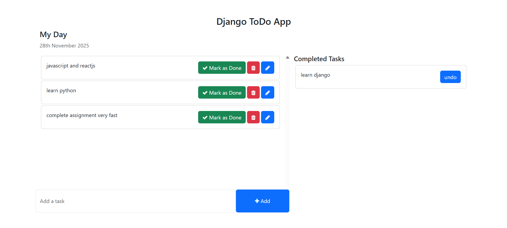
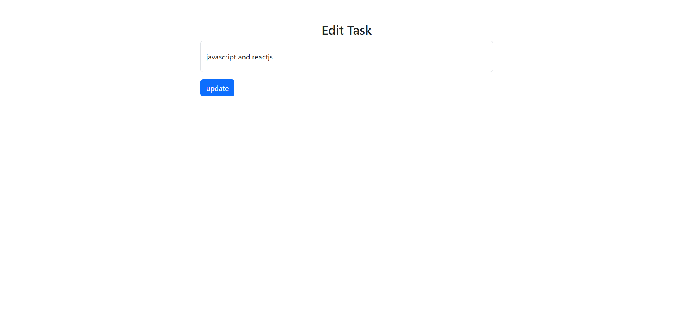

# 🌟 Django ToDo App — A Clean & Modern Task Manager

A simple yet powerful **To-Do List Web Application** built with **Django + Bootstrap 5**, featuring a clean UI, smooth user experience, and full CRUD functionality.  
Manage your daily tasks with ease — **add, edit, delete, complete, and undo tasks** in a single click.

Perfect for **beginners**, **portfolio projects**, and anyone learning **Django MVC, templates, views, and CRUD operations**.

---

## ✨ Key Highlights

- ✔️ Create, update, delete & complete tasks  
- ↩️ Undo completed tasks instantly  
- 🎨 Modern, responsive Bootstrap UI  
- 📅 “My Day” section with dynamic date display  
- 🔄 Automatic separation of Active & Completed tasks  
- 💾 SQLite backend with Django ORM  
- 📚 Clean and beginner-friendly structure  
- 🧩 Easily extendable (auth, categories, priorities, due dates, etc.)

---

## 🚀 Why This Project Is Awesome

This project demonstrates **real-world Django concepts**, making it perfect for learning:

- Custom views & URL routing  
- Template rendering with context  
- Handling forms (POST, CSRF tokens, validation)  
- Bootstrap UI integration  
- Django ORM querying  
- Full CRUD operations  
- Clean and scalable folder structure  

Ideal for interviews, portfolios, hackathons, and full-stack learning.

---

## 🛠 Tech Stack

**Backend:** Django (Python)  
**Frontend:** Bootstrap 5, HTML5, CSS3  
**Database:** SQLite (default)  
**Tools:** Django ORM, Template Engine  

---

## 📸 Screenshots

### 📝 ToDo List Page  


### ✏️ Edit Task Page  


---

## 🏷️ Technology Badges


---

## 💡 Future Enhancements

- 🔐 User authentication (login-based tasks)  
- 🏷 Task categories/tags  
- ⏰ Due dates and reminders  
- ⭐ Priority-based tasks  
- 🌙 Dark mode UI  

---

## 🤝 Contributing

1. Fork the repository  
2. Create a branch:  
   ```bash
   git checkout -b feature/my-feature
   ```
3. Commit your changes  
4. Push the branch  
5. Open a Pull Request  

---

## 📄 License

This project is licensed under the **MIT License**.

---

## 👤 Author

**Nischal V.U**  
Feel free to connect or contribute!
